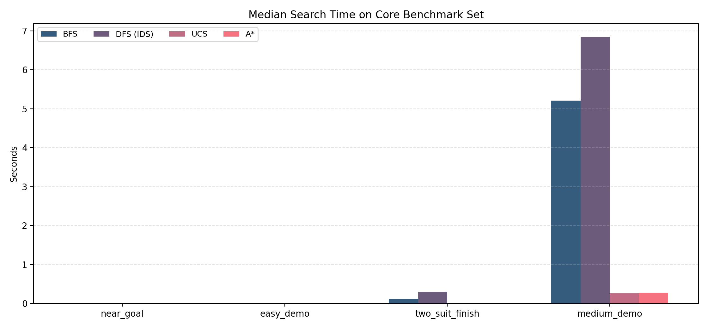
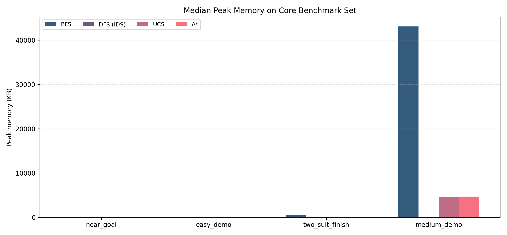
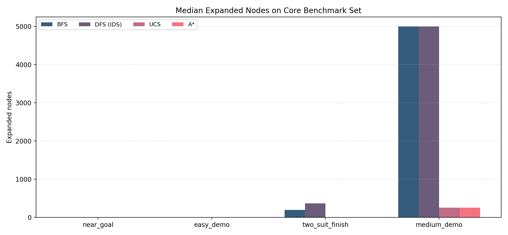
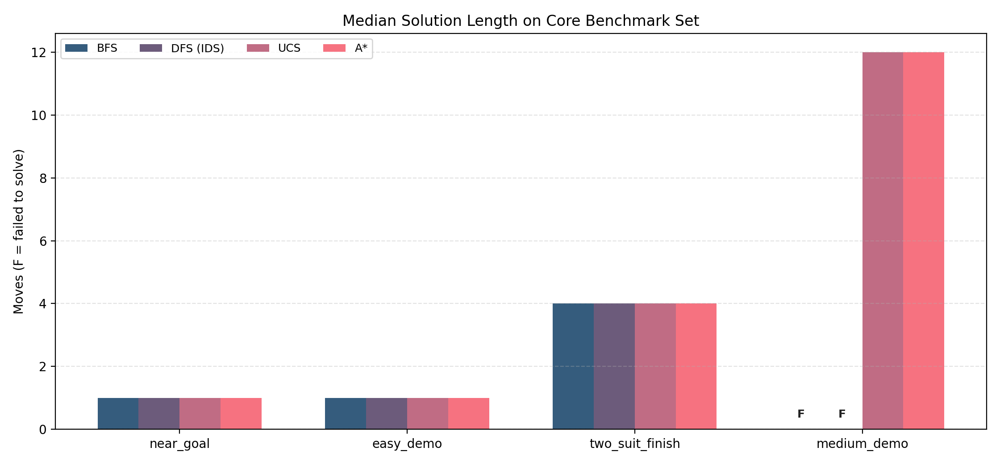

# CSC14003 Project 1 Report

**Project:** FreeCell Solver  
**Course:** CSC14003 - Introduction to Artificial Intelligence  
**Deliverable:** Section 3.6 Report  
**Date:** 2026-03-27  

**Team information:**  
TODO: replace the placeholders below with the actual team member names and student IDs before submission.

| Member | Student ID | Role |
|---|---|---|
| TODO Member 1 | TODO ID 1 | TODO |
| TODO Member 2 | TODO ID 2 | TODO |
| TODO Member 3 | TODO ID 3 | TODO |

## 1. Introduction

This project implements a desktop FreeCell application in Python with a tkinter GUI, shared game rules, and multiple search-based solvers. The current repository supports manual card movement, Microsoft numbered deals, random shuffled boards, built-in sample boards, solver execution in a background thread, live search metrics, and replay of either the final solution or the best-progress trace.

The required algorithms present in the current codebase are:

- BFS
- DFS implemented as IDS (`DFS (IDS)` in the solver name)
- UCS
- A*

The repository also contains an additional practical `Expert Solver`, but this report keeps the required analysis and experiments focused on BFS, DFS/IDS, UCS, and A* as requested by the project brief.

## 2. Project Planning and Task Distribution

Section 3.6 of the brief requires each member's responsibilities and completion percentage to be reported. The exact team allocation data was not available in the repository, so the table below is left as a visible placeholder for the team to fill in before submission.

| Member | Student ID | Assigned tasks | Completion percentage | Notes |
|---|---|---|---:|---|
| TODO Member 1 | TODO ID 1 | TODO: GUI / game logic / report / experiments | TODO | TODO |
| TODO Member 2 | TODO ID 2 | TODO: BFS / DFS / UCS / A* / testing | TODO | TODO |
| TODO Member 3 | TODO ID 3 | TODO: deal generation / replay / evaluation | TODO | TODO |

The brief gives the individual score example:

> If the group score is 9.0 and a student's completion percentage is 90%, then the student's individual score is `9.0 x 90% = 8.1`.

## 3. System Overview

### 3.1 Architecture

The application entry point is `main.py`, which launches `gui.app.FreeCellApp`. The codebase is organized into four main layers:

- `gui/`
  - `app.py`: tkinter GUI, board drawing, solver controls, replay controls, solver worker thread integration, and live metrics.
  - `progress_queue.py`: bounded queue used to keep the newest progress snapshots.
- `game/`
  - `card.py`: card representation.
  - `state.py`: immutable `GameState`.
  - `moves.py`: legal move generation, state transitions, safe auto-moves, and sequence-move handling.
  - `deal.py` and `ms_deals.py`: Microsoft numbered deal generation and random shuffled board generation.
  - `samples.py`: built-in sample boards.
- `solvers/`
  - `base.py`: `SolverResult`, `ProgressSnapshot`, timing, memory measurement, progress callbacks, and stop handling.
  - `bfs.py`, `dfs.py`, `ucs.py`, `astar.py`: the four required search algorithms.
  - `expert_solver.py`: extra practical solver not used as a substitute for the required algorithms in this report.
- `tests/`
  - Unit tests for solver behavior, replay, app flow, Microsoft deals, layout/rules, progress queue, and the Expert Solver.

### 3.2 GUI and Replay Behavior

The GUI provides:

- `New Game`, `Sample`, `Restart`, and `Undo`
- Solver buttons: `BFS`, `DFS`, `UCS`, `A*`, `Expert Solver`
- Replay controls: `Play`, `Pause`, `Step`, `Back`
- `Stop` for the currently running solver
- A live metrics bar showing algorithm name, board source, status, moves, time, memory, expanded nodes, generated nodes, frontier size, and search length

When a solver finishes successfully, the GUI stores the full solution for replay. If a solver stops or fails but has a best-progress trace, the GUI still enables replay using that stored trace.

## 4. Search Problem Formulation

### 4.1 State Representation

The state is represented by `game.state.GameState`:

- `cascades`: 8 tableau columns stored as tuples from bottom to top
- `free_cells`: 4 free-cell slots
- `foundations`: 4 integers storing the highest completed rank of each suit

The class is immutable: every move creates a new `GameState`.

### 4.2 Actions

Legal actions are produced by `game.moves.get_valid_moves(state)`. The action types in the current implementation are:

- cascade -> foundation
- free cell -> foundation
- cascade -> free cell
- free cell -> cascade
- cascade -> cascade, including single-card and multi-card alternating sequences

Sequence moves use the standard FreeCell carrying-capacity formula:

`max sequence length = (empty free cells + 1) x 2^(usable empty cascades)`

### 4.3 Transition Model

The transition function is `game.moves.apply_move(state, move)`. It:

1. removes card(s) from the source location,
2. adds them to the destination location,
3. returns a new immutable `GameState`.

The GUI uses the same shared rules engine as the solvers, which keeps manual play and automated search consistent.

### 4.4 Goal Test

The goal test is `GameState.is_goal()`, which returns `True` when all four foundations have reached rank 13.

### 4.5 Cost Function

The repository uses different path-cost models depending on the algorithm:

- BFS: implicit unit depth cost
- DFS/IDS: implicit unit depth cost under iterative deepening
- UCS: explicit non-uniform move cost from `solvers.ucs.move_cost()`
  - move to foundation: cost `0`
  - move to free cell: cost `3`
  - any cascade move: cost `1`
- A*: path cost `g` is the number of moves, so each move adds `1`

This means the UCS solution length is still reported in number of moves, but the search order is determined by the custom weighted move cost above.

### 4.6 Repeated-State Handling

Repeated-state handling relies on `GameState.canonical_key()`. This key:

- includes the exact cascades,
- sorts free cells as a multiset,
- includes the foundation tuple.

This symmetry reduction is important because free-cell slot order does not matter for search.

The algorithms use it as follows:

- BFS: visited-state suppression through the `parent` dictionary
- UCS: best-cost table `best_g`
- A*: best-cost table `best_g`
- DFS/IDS: path-based cycle detection only (`path_keys`), not a global visited set across iterations

## 5. Algorithm Description

### 5.1 BFS

The BFS solver is implemented in `solvers/bfs.py`.

Implementation-specific details:

- Frontier data structure: `collections.deque`
- Pop policy: FIFO using `popleft()`
- Goal test:
  - once before entering the loop,
  - again immediately after generating each child
- Parent tracking:
  - `parent[child_key] = (state, move)`
  - final path reconstructed by `BaseSolver._reconstruct()`
- Repeated-state handling:
  - a child is skipped if its canonical key is already present in `parent`
- Progress behavior:
  - keeps `best_state` and `best_trace_length` for replay after failure or stop

Strengths:

- complete under the explored state space
- simple and easy to reason about
- finds minimum-move solutions when every move has equal cost

Weaknesses in this project:

- high frontier memory usage
- quickly reaches the node cap on nontrivial boards such as `medium_demo`
- less practical for large FreeCell positions

### 5.2 DFS or IDS

The repository's DFS requirement is implemented as iterative deepening DFS in `solvers/dfs.py`, and the solver reports its name as `DFS (IDS)`.

Implementation-specific details:

- Outer loop: depth limit increases from `1` to `MAX_DEPTH`
- Recursive search function: `_dls()`
- Frontier behavior:
  - depth-first recursion over the current path
- Goal test:
  - before depth-limit cutoff in `_dls()`
- Repeated-state handling:
  - `path_keys` stores only the current recursion path
  - there is no global repeated-state table across depth iterations
- Best-progress retention:
  - `_best_trace` and `_best_trace_length` are updated whenever a better partial path is found

Strengths:

- extremely low memory compared with BFS and UCS
- satisfies the DFS requirement while being explicit that the implementation is IDS

Weaknesses:

- repeated work across depth iterations
- can expand many nodes without solving medium boards
- in this repository it often uses the most time among the required algorithms under the equal node cap

### 5.3 UCS

The UCS solver is implemented in `solvers/ucs.py`.

Implementation-specific details:

- Frontier data structure: `heapq`
- Heap item: `(g, counter, state)`
- Cost model from the code:
  - foundation move = `0`
  - free-cell move = `3`
  - cascade move = `1`
- Repeated-state handling:
  - best-known path cost table `best_g`
- Parent tracking:
  - `parent[child_key] = (state, move)`
- Goal test:
  - checked when a state is popped from the priority queue

Interpretation:

The UCS implementation does not treat every move equally. Instead, it makes foundation moves free, penalizes parking cards in free cells, and gives ordinary cascade moves moderate cost. Therefore, UCS in this repository is optimizing the custom path cost used by the implementation, not necessarily the fewest number of moves.

Strengths:

- robust repeated-state handling
- much more practical than BFS and IDS on the `medium_demo` board
- produces complete solutions on the tested core set within the selected node cap

Weaknesses:

- the custom cost function means the search objective is not pure shortest-path in move count
- memory usage grows because many frontier states remain active

### 5.4 A*

The A* solver is implemented in `solvers/astar.py`.

Implementation-specific details:

- Frontier data structure: `heapq`
- Heap item: `(f, counter, g, state)`
- Path cost:
  - `g = number of moves`
- Heuristic:
  - `h1 = 52 - sum(foundations)` (cards not yet on foundation)
  - `h2 = hidden-blocker penalty` for the next needed foundation card in each suit
  - `h3 = (4 - empty_free_cells) * 0.5` (occupied free-cell penalty)
  - total heuristic: `h = h1 + h2 + h3`
- Repeated-state handling:
  - best-known path cost table `best_g`
- Parent tracking:
  - `parent[child_key] = (state, move)`

Admissibility / consistency note:

The current heuristic is not formally admissible in the implementation as written. A direct counterexample exists in the current codebase: if the only remaining move is `K clubs` from a free cell to the foundation, the true remaining cost is `1`, but the heuristic returns `1.5` because of the occupied free-cell penalty. Therefore this A* implementation should be described as a heuristic best-first search using `f = g + h`, but without a valid optimality guarantee.

Strengths:

- solves the `medium_demo` board under the same node cap where BFS and IDS fail
- significantly reduces expanded nodes compared with BFS and IDS on the harder core case

Weaknesses:

- not guaranteed optimal with the current heuristic
- still fails on the full Microsoft stress case under the equal node cap

## 6. Experiments

### 6.1 Requirement from the Brief

Page 5 of `CSC14003 - Project 1.pdf` requires:

- a fixed test set for fairness,
- measurements of search time, peak memory, expanded nodes, and solution length,
- tables and charts,
- insights and discussion.

### 6.2 Methodology

Experiments were run directly from the repository's solver modules, not from an external tool. The benchmark runner was created in:

- `report_tools/run_report_experiments.py`

Settings:

- required algorithms only: BFS, DFS (IDS), UCS, A*
- same node cap for every run: `5,000`
- same solver setting for every run: `use_auto_moves=False`
  - this matches how the GUI instantiates its solver buttons in `gui/app.py`
- number of trials per algorithm-board pair: `3`
- reported value: median of the 3 trials
- metric source:
  - search time and peak memory come from `BaseSolver.solve()`
  - peak memory is tracked by `tracemalloc`
  - expanded nodes and solution length come from `SolverResult`

Environment:

- Python: `3.10.11`
- Implementation: `CPython`
- Platform: `Windows-10-10.0.22631-SP0`
- CPU string reported by Python: `Intel64 Family 6 Model 167 Stepping 1, GenuineIntel`

### 6.3 Fixed Test Set

To keep the comparison fair and tractable for BFS and IDS, the report uses the following **core fixed set** for all four required algorithms:

| Board | Source | Purpose |
|---|---|---|
| `near_goal` | hand-crafted `GameState` | trivial one-move completion |
| `easy_demo` | built-in sample board | trivial sample board from the repository |
| `two_suit_finish` | hand-crafted `GameState` | small nontrivial finish state with a 4-move solution |
| `medium_demo` | built-in sample board | harder repository sample board |

An additional **stress case** is reported separately:

| Board | Source | Purpose |
|---|---|---|
| `ms_deal_1` | `GameState.initial(ms_deal(1))` | full Microsoft deal stress test under the same node cap |

The Microsoft deal is reported separately because it is useful for realism, but under the equal `5,000`-node budget all four required algorithms fail on that full deal, so it is more informative as a stress case than as the only comparison set.

## 7. Experimental Results

### 7.1 Core Benchmark Table

Median results across three trials:

| Board | Algorithm | Solved? | Search time (s) | Peak memory (KB) | Expanded nodes | Solution length |
|---|---|---:|---:|---:|---:|---:|
| `near_goal` | BFS | Yes | 0.000098 | 2.469 | 1 | 1 |
| `near_goal` | DFS (IDS) | Yes | 0.000098 | 2.789 | 1 | 1 |
| `near_goal` | UCS | Yes | 0.000311 | 5.625 | 2 | 1 |
| `near_goal` | A* | Yes | 0.000329 | 5.688 | 2 | 1 |
| `easy_demo` | BFS | Yes | 0.000091 | 2.469 | 1 | 1 |
| `easy_demo` | DFS (IDS) | Yes | 0.000087 | 2.375 | 1 | 1 |
| `easy_demo` | UCS | Yes | 0.000303 | 5.625 | 2 | 1 |
| `easy_demo` | A* | Yes | 0.000318 | 5.730 | 2 | 1 |
| `two_suit_finish` | BFS | Yes | 0.127405 | 588.949 | 194 | 4 |
| `two_suit_finish` | DFS (IDS) | Yes | 0.301666 | 11.229 | 371 | 4 |
| `two_suit_finish` | UCS | Yes | 0.004290 | 42.742 | 9 | 4 |
| `two_suit_finish` | A* | Yes | 0.003435 | 42.844 | 9 | 4 |
| `medium_demo` | BFS | No | 5.207949 | 43092.852 | 5000 | 0 |
| `medium_demo` | DFS (IDS) | No | 6.843405 | 25.625 | 5000 | 0 |
| `medium_demo` | UCS | Yes | 0.265320 | 4626.531 | 256 | 12 |
| `medium_demo` | A* | Yes | 0.274063 | 4687.719 | 256 | 12 |

### 7.2 Stress Test Table

Median results across three trials on the full Microsoft stress case:

| Board | Algorithm | Solved? | Search time (s) | Peak memory (KB) | Expanded nodes | Solution length | Status |
|---|---|---:|---:|---:|---:|---:|---|
| `ms_deal_1` | BFS | No | 2.063527 | 12224.195 | 5000 | 0 | Node limit reached |
| `ms_deal_1` | DFS (IDS) | No | 3.040895 | 13.664 | 5000 | 0 | Node limit reached |
| `ms_deal_1` | UCS | No | 3.425165 | 25728.516 | 5000 | 0 | Node limit reached |
| `ms_deal_1` | A* | No | 2.882311 | 19465.168 | 5000 | 0 | Node limit reached |

### 7.3 Charts

#### Search Time



#### Peak Memory



#### Expanded Nodes



#### Solution Length



### 7.4 Short Observations

- On the trivial one-move boards, all algorithms behave similarly and differences are negligible.
- On `two_suit_finish`, UCS and A* are dramatically more efficient than BFS and IDS.
- On `medium_demo`, BFS and IDS both exhaust the equal `5,000`-node budget without solving, while UCS and A* both solve the board with solution length `12`.
- On `ms_deal_1`, all four required algorithms hit the node cap, which makes it a useful stress case but not a good discriminating core benchmark under the selected equal resource limit.

## 8. Discussion

### 8.1 Practical Comparison

On the core set, UCS and A* are the strongest among the four required algorithms in the current repository.

- BFS
  - strongest on conceptual simplicity
  - weakest on memory growth
  - fails on `medium_demo` at the equal node cap
- DFS (IDS)
  - uses very little memory
  - pays for that with repeated search and higher runtime
  - also fails on `medium_demo` at the equal node cap
- UCS
  - solves every board in the core set under the chosen budget
  - benefits strongly from the repository's non-uniform cost function
- A*
  - performs almost identically to UCS on the current core set
  - also solves every core board under the chosen budget

### 8.2 Time and Memory Behavior

The repository exhibits the expected trade-offs:

- BFS stores many frontier states and therefore has the highest memory usage on the difficult core case (`43092.852 KB` on `medium_demo`).
- IDS keeps memory low (`25.625 KB` on `medium_demo`) because it does not maintain a large frontier, but runtime becomes the largest in the core benchmark (`6.843405 s` on `medium_demo`).
- UCS and A* both use more memory than IDS, but far less than BFS on the hard sample board, and they solve that board within the cap.

### 8.3 Solution-Length Quality

On the solvable boards:

- all algorithms return the same move count on the simple finish states,
- UCS and A* both return a length-12 solution on `medium_demo`.

However, the interpretation differs:

- BFS and IDS optimize or explore by depth,
- UCS optimizes the repository's custom weighted move cost rather than plain move count,
- A* uses a heuristic that is not formally admissible in the current code, so it should not be described as guaranteed optimal.

### 8.4 Extra Practical Solver

The repository also contains an `Expert Solver` button and `solvers/expert_solver.py`. It is useful as an implementation note because it is the strongest practical solver currently wired into the GUI, but it is outside the required BFS / DFS(IDS) / UCS / A* comparison requested by the brief, so it is not used as a replacement in the main experiment tables.

### 8.5 Limitations of This Evaluation

- The team contribution data was not available in the repository, so that part remains a placeholder.
- The full Microsoft deal stress case was not solved by any of the four required algorithms under the equal `5,000`-node cap.
- The project brief PDF was available locally, but only the required report section (page 5) was extracted for this report-generation run.
- The current repository has known implementation issues already noted in `AUDIT_REPORT.md`, so the report describes the code as it exists now, not an idealized version.

## 9. Conclusion

The current FreeCell Solver repository satisfies the main structural requirement of implementing handwritten search algorithms inside a playable Python GUI application. The required algorithms are all present, and the codebase exposes the necessary performance metrics for fair experimentation. Under an equal `5,000`-node budget, BFS and IDS handle only the smallest finish states, while UCS and A* also solve the harder `medium_demo` sample board. For the current implementation, UCS and A* are the most practical of the four required algorithms, while BFS is constrained mainly by memory and IDS mainly by repeated work and runtime.

## 10. References

1. `CSC14003 - Project 1.pdf`, Section 3.6 "Report", page 5. Local course brief PDF found at `C:\MEGA\co so ttnt\CSC14003 - Project 1.pdf`.
2. Repository source code used as the primary implementation reference:
   - `main.py`
   - `gui/app.py`
   - `gui/progress_queue.py`
   - `game/state.py`
   - `game/moves.py`
   - `game/deal.py`
   - `game/ms_deals.py`
   - `solvers/base.py`
   - `solvers/bfs.py`
   - `solvers/dfs.py`
   - `solvers/ucs.py`
   - `solvers/astar.py`
3. Repository test code used to validate current behavior:
   - `tests/test_app_flow.py`
   - `tests/test_solver_behavior.py`
   - `tests/test_solver_replay.py`
   - `tests/test_replay_controls.py`
   - `tests/test_ms_deals.py`
   - `tests/test_layout_and_rules.py`

## 11. Appendix

### 11.1 Experiment Files

Generated during this report run:

- `report_data/experiment_results_raw.csv`
- `report_data/experiment_results_summary.csv`
- `report_data/experiment_environment.json`
- `report_assets/chart_search_time.png`
- `report_assets/chart_peak_memory.png`
- `report_assets/chart_expanded_nodes.png`
- `report_assets/chart_solution_length.png`

### 11.2 Commands Used

```bash
python report_tools/run_report_experiments.py
python -m unittest discover -s tests
python main.py
```

### 11.3 Generative AI Usage

This report-generation session used Generative AI to:

- inspect the codebase structure,
- extract algorithm details from the source files,
- run reproducible experiments,
- summarize the results,
- generate charts,
- draft `report.md`,
- generate `Report.pdf`.

All numerical results in this report come from actual runs of the current repository. The generated text and tables were checked against the code and CSV outputs before the PDF was produced.

### 11.4 Prompts Used

Prompts used in this session that affected the current repository or report:

1. "Patch the existing FreeCell desktop app in place... Add one extra solver button in the app for a much stronger practical solver..."
2. "You are working inside an existing FreeCell Solver project for CSC14003 Project 1... write two files from scratch, accurately, based on the real app: README.md and requirements.txt."
3. "You are working inside an existing CSC14003 Project 1 FreeCell Solver repository... create the full report deliverable for section 3.6... and produce a final PDF report file."

TODO: if the team used additional GenAI prompts during development outside this session, paste them here before submission.

### 11.5 Manual Verification Note

The final report artifacts were generated automatically from actual experiment results, then checked manually for:

- consistency with the current codebase,
- consistency with the extracted section 3.6 brief requirements,
- readable charts,
- presence of all required report sections.
